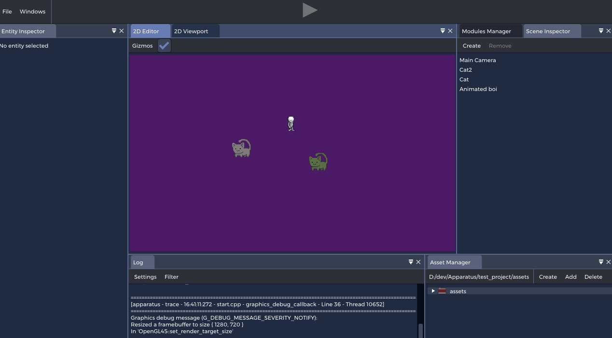
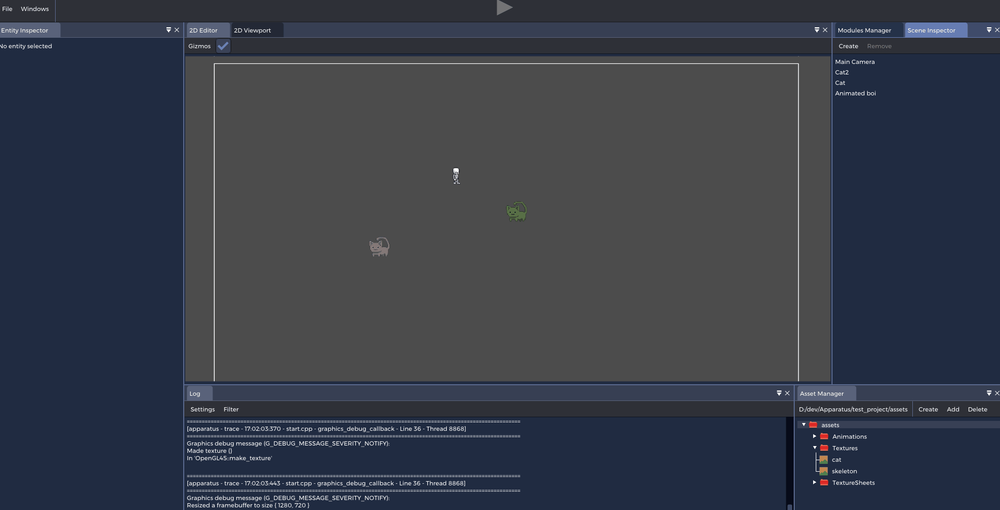

# Apparatus
Modular game engine with fully native runtime gameplay
programming.

# Note
I haven't been able to put much work into this as it's a hobby project and I have
a very high rent to pay with a very low pay. It's likely that I won't be able to
put any work in at all soon as it seems that I'm going to have to sell my laptop
to pay the rent. Feel free to contribute while I'm gone, I'll have a crappy laptop
to at least check in on the repo.

# Philosophy
## Customize everything
Everything should be customizable to the liking of the user! Be that from the color of buttons to the colors of error messages and the size of input fields.
## Modular & Extensible
Everything is divided into modules (shared libraries). The idea is that these should be completely removable. If you don't want a renderer for your game you could just unload it (and probably replace it with your own). In general, things are designed to be extensible. For example, anyone can create a new asset by registering an asset loader in the asset manager module.
## Runtime C++ compiling (+ language extension)
With dynamically loaded modules we can rebuild a module in runtime and then do a hot reload. This means that we can compile C++ code in runtime. No scripting whatsover - just native C++ code. When building a module there's a parser which goes through the header files for some introspection. This means that there's some simple language extension for creating components and the like in runtime.
## No hidden data
There cannot be full modularity if all data is hidden. Everything in the engine is in some way accessible to everything. This does of course mean that's it's very easy to break everything, which is why proper documentation is a must. The engine WILL crash at several occasions, but it will also be designed with this in mind.
## Portability
The goal is to support all platforms and the code is design to do so. However at the moment Apparatus really only builds on Windows and most Linux distributions on x64 systems.

# Plan
A trello board can be found <a href="https://trello.com/b/xe6pIKCK/apparatus">here</a>.

# Building

1. Clone the repo
    
    `git clone https://github.com/asbott/Apparatus my_repo_dir`
    
    `cd my_repo_dir`
2. Initialize and update submodules
    
    `git submodule update --init`
3. Generate project files
    - Windows, Visual Studio 2019: 
        
        `premake5.exe vs2019`
    - Unix, makefiles: 
    
        `./premake5 gmake2`
4. Build the <i>parser</i> project
    - With Visual Studio 2019: Right click the <i>parser</i> project and hit <i>build</i>
    - With makefiles & make: 

        `make parser`

Apparatus should be fully functional on Linux systems using x11. Has been tested with Manjaro 20.1.2, compiling with g++ 10.2.0.

# Showcase
As of 21-11-2020

## Runtime 2D editor

## Full customizability

## Ecs (entt)

## 2D physics (box2d)

 
## Sprite sheet animation

