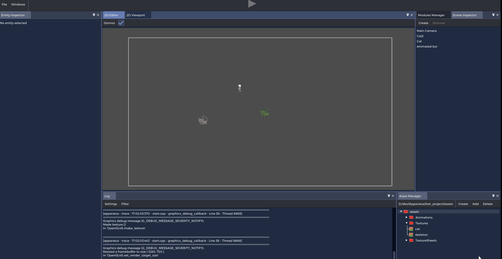

# Apparatus
Modular game engine with fully native runtime gameplay
programming.

# Building
After cloning the repo, make sure all git modules are initialized and updated:
`git submodule update --init`
 Then simply generate project files with premake5. From the repo directory, run: `premake5.exe vs2019` on windows or `./premake5 gmake2` on unix (replace `vs2019` and `gmake2` with whatever project manager you want).

Apparatus should be fully functional on Linux systems using x11. Has been tested with Manjaro 20.1.2, compiling with g++ 10.2.0.

# Showcase
Runtime management of entites/components (entt backend)

Asset management and dnd

Editor viewport & interactions (click to select, drag, multiselect)

2D physics (box2d backend)

Multiple cameras

Runtime c++ compiling (hot reloading modules), language extension & introspection. Say no to scripting. Just pure C++ code.

Entt api for gameplay programming in modules

Moreover, everything is pretty much fully modular with the runtime module system so it's very easy to extend and add or customize features. For example, if you don't like the default renderer you can replace it with your own DLL, as long as it is a valid apparatus module and use the same .h file.